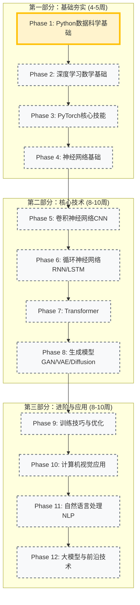

# 🗺️ 深度学习课程路线图

> **当前状态**: 🚀 准备开始第 1 阶段 (Python 数据科学基础)
> **总体进度**: 0% (完成 0/12 阶段)

## 📅 学习路径概览

---

## 📍 详细里程碑

### ⏳ 第一部分：基础夯实 (Phase 1-4)

这一部分建立深度学习的核心基础。

- **Phase 1**: Python 数据科学工具栈（NumPy、Pandas、Matplotlib）
- **Phase 2**: 深度学习数学基础（线性代数、微积分、概率论）
- **Phase 3**: PyTorch 框架核心（Tensor、Autograd、nn.Module）
- **Phase 4**: 神经网络原理（MLP、激活函数、正则化）

### 🔮 第二部分：核心技术 (Phase 5-8)

掌握深度学习核心架构。

#### Phase 5: 卷积神经网络 CNN

- [ ] 卷积操作与池化
- [ ] 经典架构（LeNet、AlexNet、VGG、ResNet）
- [ ] 特征可视化与 Grad-CAM
- [ ] **实战**: CIFAR-10 图像分类

#### Phase 6: 循环神经网络 RNN/LSTM

- [ ] RNN 基础与 BPTT
- [ ] LSTM 与 GRU 门控机制
- [ ] 序列到序列模型
- [ ] **实战**: 文本生成、时间序列预测

#### Phase 7: 注意力机制与 Transformer

- [ ] 自注意力与多头注意力
- [ ] Transformer 编码器/解码器
- [ ] BERT 与 GPT 架构理解
- [ ] **实战**: 机器翻译、文本分类

#### Phase 8: 生成模型

- [ ] GAN 系列（DCGAN、WGAN）
- [ ] 变分自编码器 VAE
- [ ] 扩散模型基础
- [ ] **实战**: 图像生成

### 🚀 第三部分：进阶与应用 (Phase 9-12)

工业级能力培养。

#### Phase 9: 训练技巧与优化

- [ ] 高级优化器（Adam、AdamW）
- [ ] 学习率调度
- [ ] 混合精度训练
- [ ] 分布式训练基础

#### Phase 10: 计算机视觉应用

- [ ] 目标检测（YOLO、R-CNN）
- [ ] 图像分割（U-Net）
- [ ] 姿态估计、人脸识别

#### Phase 11: 自然语言处理 NLP

- [ ] 词向量与文本表示
- [ ] NLP 核心任务（分类、NER、QA）
- [ ] HuggingFace Transformers
- [ ] 参数高效微调（LoRA）

#### Phase 12: 大模型与前沿技术

- [ ] LLM 架构理解
- [ ] 指令微调与 RLHF
- [ ] 模型量化与推理优化
- [ ] 多模态与 Agent

---

## 🏆 实战项目规划

| 项目                | 对应阶段 | 核心技术点                | 状态      |
| :------------------ | :------- | :------------------------ | :-------- |
| **探索性数据分析**  | Phase 1  | NumPy, Pandas, Matplotlib | ⏳ 待开始 |
| **MNIST 手写数字**  | Phase 3  | PyTorch 基础, 训练循环    | ⏳ 待开始 |
| **房价预测**        | Phase 4  | MLP, 回归任务             | ⏳ 待开始 |
| **CIFAR-10 分类器** | Phase 5  | CNN, ResNet               | ⏳ 待开始 |
| **文本生成器**      | Phase 6  | LSTM, 语言模型            | ⏳ 待开始 |
| **机器翻译**        | Phase 7  | Transformer               | ⏳ 待开始 |
| **图像生成**        | Phase 8  | GAN/Diffusion             | ⏳ 待开始 |
| **目标检测系统**    | Phase 10 | YOLO                      | ⏳ 待开始 |
| **情感分析系统**    | Phase 11 | BERT 微调                 | ⏳ 待开始 |
| **LLM 微调项目**    | Phase 12 | LoRA, PEFT                | ⏳ 待开始 |

---

> _此路线图基于 `LEARNING_PLAN.md` 生成，随学习进度动态更新。_
