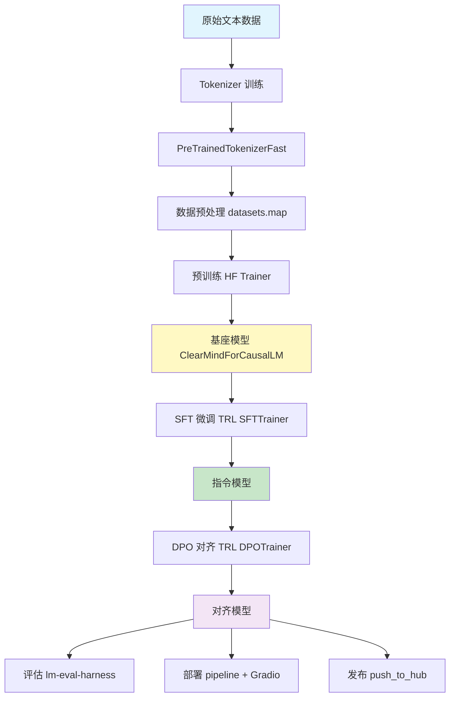

# ClearMind-HF 产品需求文档 (PRD)

> **版本:** v1.0
> **日期:** 2026-03-21
> **作者:** ClearMind Team
> **姊妹项目:** [ClearMind (from-scratch)](../capstone-llm-from-scratch/)

---

## 1. 项目背景

### 1.1 项目定位

ClearMind-HF 是 ClearMind (from-scratch) 的 **HuggingFace 生态姊妹项目**。两者共享相同的模型架构（RoPE + RMSNorm + SwiGLU + GQA），但实现方式截然不同：

| 维度 | ClearMind (from-scratch) | ClearMind-HF |
|------|--------------------------|--------------|
| 核心理念 | 从零理解每一行代码 | 站在巨人肩膀上构建 |
| 模型定义 | 纯 PyTorch nn.Module | 自定义 PreTrainedModel |
| 分词器 | sentencepiece 手动封装 | HF tokenizers + PreTrainedTokenizerFast |
| 训练循环 | 手写 training loop | HF Trainer + TRL |
| LoRA | 手写 LoRALinear | PEFT 库 |
| 多卡训练 | 手写 DDP | accelerate |
| 数据处理 | 自定义 Dataset | datasets + DataCollator |
| 评估 | 手写 eval | lm-eval-harness |
| 部署 | 手写 API | HF pipeline + Gradio |

### 1.2 动机

```
┌──────────────────────────────────────────────────────────────┐
│                      学习路径                                 │
│                                                              │
│   from-scratch 版 ──→ 理解原理 ──→ HF 版 ──→ 工业实践       │
│   (手写每一行)        (为什么)      (怎么用)    (生产力)       │
└──────────────────────────────────────────────────────────────┘
```

**为什么需要 HF 版？**

1. **工业标准**：绝大多数 LLM 项目基于 HF 生态构建
2. **效率提升**：Trainer 封装了梯度累积、混合精度、分布式等复杂逻辑
3. **生态互通**：模型可直接 push 到 Hub，被全球开发者使用
4. **对比学习**：通过两版对比，深入理解 HF 封装了什么、为什么这样封装

### 1.3 愿景

> 让学习者在完成 from-scratch 版后，通过 HF 版本的对比实践，掌握 HuggingFace 生态的核心机制，具备独立使用 HF 全家桶训练和部署 LLM 的能力。

---

## 2. 功能需求

### 2.1 Tokenizer 模块

| # | 功能项 | 优先级 | from-scratch 对应 | HF 实现方式 |
|---|--------|--------|-------------------|-------------|
| T1 | BPE 分词器训练 | 🔥 P0 | train_tokenizer.py (sentencepiece) | tokenizers 库 ByteLevelBPETokenizer |
| T2 | 封装为 HF 格式 | 🔥 P0 | ClearMindTokenizer 类 | PreTrainedTokenizerFast |
| T3 | 特殊 token 管理 | 🔥 P0 | `<s>/<​/s>/<pad>/<unk>` 手动定义 | special_tokens_map.json + tokenizer_config.json |
| T4 | Chat Template | ⚡ P1 | 硬编码在 chat.py | Jinja2 模板 + apply_chat_template() |
| T5 | 保存/加载 | 🔥 P0 | .model 文件 | tokenizer.save_pretrained() / from_pretrained() |

### 2.2 模型模块

| # | 功能项 | 优先级 | from-scratch 对应 | HF 实现方式 |
|---|--------|--------|-------------------|-------------|
| M1 | 模型配置 | 🔥 P0 | ModelConfig dataclass | ClearMindConfig(PretrainedConfig) |
| M2 | 模型定义 | 🔥 P0 | GPT(nn.Module) | ClearMindForCausalLM(PreTrainedModel) |
| M3 | 权重初始化 | 🔥 P0 | _init_weights() | _init_weights() + post_init() |
| M4 | AutoClass 注册 | ⚡ P1 | 无 | AutoModelForCausalLM.register() |
| M5 | 参数量验证 | ⚡ P1 | model.count_parameters() | model.num_parameters() |
| M6 | 权重保存/加载 | 🔥 P0 | torch.save/load state_dict | save_pretrained() / from_pretrained() |
| M7 | generate() 集成 | 🔥 P0 | 手写 generate.py | GenerationMixin.generate() |

### 2.3 数据处理模块

| # | 功能项 | 优先级 | from-scratch 对应 | HF 实现方式 |
|---|--------|--------|-------------------|-------------|
| D1 | 数据下载/准备 | 🔥 P0 | prepare_data.py | datasets.load_dataset() 或自定义脚本 |
| D2 | 预训练数据集 | 🔥 P0 | PretrainDataset | datasets + DataCollatorForLanguageModeling |
| D3 | SFT 数据集 | 🔥 P0 | SFTDataset (Alpaca/ShareGPT) | datasets + chat template 格式化 |
| D4 | DPO 数据集 | 🔥 P0 | DPODataset | datasets + DPOTrainer 内置数据处理 |
| D5 | 数据预处理流水线 | ⚡ P1 | Dataset.__getitem__() | dataset.map() + tokenizer 批处理 |

### 2.4 训练模块

| # | 功能项 | 优先级 | from-scratch 对应 | HF 实现方式 |
|---|--------|--------|-------------------|-------------|
| TR1 | 预训练 | 🔥 P0 | PreTrainer (step-based) | HF Trainer + TrainingArguments |
| TR2 | SFT 微调 | 🔥 P0 | SFTTrainer (epoch-based) | TRL SFTTrainer + SFTConfig |
| TR3 | DPO 对齐 | 🔥 P0 | DPOTrainer (epoch-based) | TRL DPOTrainer + DPOConfig |
| TR4 | 梯度累积 | 🔥 P0 | 手动 accumulation_steps 控制 | TrainingArguments.gradient_accumulation_steps |
| TR5 | 混合精度 | ⚡ P1 | GradScaler + autocast | TrainingArguments.bf16/fp16 |
| TR6 | 学习率调度 | 🔥 P0 | CosineWarmupScheduler | TrainingArguments.lr_scheduler_type |
| TR7 | Early Stopping | ⚡ P1 | EarlyStopping 类 | EarlyStoppingCallback |
| TR8 | Checkpoint | 🔥 P0 | 手动 torch.save | TrainingArguments.save_strategy |
| TR9 | 训练日志 | ⚡ P1 | TrainingLogger | TensorBoard / WandB 集成 |
| TR10 | 多卡训练 | 🟡 P2 | launch_ddp.py (torchrun) | accelerate launch |

### 2.5 PEFT 模块

| # | 功能项 | 优先级 | from-scratch 对应 | HF 实现方式 |
|---|--------|--------|-------------------|-------------|
| P1 | LoRA 微调 | 🔥 P0 | LoRALinear + apply_lora() | peft.LoraConfig + get_peft_model() |
| P2 | QLoRA 微调 | ⚡ P1 | 无 | BitsAndBytesConfig + LoRA |
| P3 | LoRA 合并 | 🔥 P0 | merge_lora() | model.merge_and_unload() |
| P4 | Adapter 保存/加载 | ⚡ P1 | 手动 save/load lora 参数 | save_pretrained() / from_pretrained() |

### 2.6 评估模块

| # | 功能项 | 优先级 | from-scratch 对应 | HF 实现方式 |
|---|--------|--------|-------------------|-------------|
| E1 | Perplexity 评估 | 🔥 P0 | eval_perplexity.py | evaluate 库 / 手动计算 |
| E2 | 生成质量评估 | ⚡ P1 | eval_generation.py | model.generate() 对比 |
| E3 | Benchmark 评估 | 🟡 P2 | eval_benchmark.py | lm-eval-harness |
| E4 | 阶段对比评估 | ⚡ P1 | 无 | Pretrain vs SFT vs DPO 横向对比 |

### 2.7 推理与部署模块

| # | 功能项 | 优先级 | from-scratch 对应 | HF 实现方式 |
|---|--------|--------|-------------------|-------------|
| I1 | 交互式对话 | 🔥 P0 | chat.py | pipeline("text-generation") |
| I2 | Web Demo | ⚡ P1 | web_demo.py (Gradio) | Gradio + pipeline |
| I3 | GGUF 导出 | 🟡 P2 | export_gguf.py | llama.cpp 转换脚本 |
| I4 | Hub 发布 | ⚡ P1 | 无 | push_to_hub() + Model Card |

---

## 3. 非功能需求

### 3.1 硬件兼容性

| 需求 | 描述 |
|------|------|
| CPU 训练 | Tiny 配置可在纯 CPU 环境训练和测试 |
| 单卡 GPU | 支持 NVIDIA GPU (CUDA)、Apple Silicon (MPS) |
| 多卡 GPU | 通过 accelerate 支持数据并行 |
| 自动设备检测 | accelerate 自动选择最优设备 |

### 3.2 性能需求

| 指标 | 目标 |
|------|------|
| Tiny 预训练 | CPU 下 200 步 < 5 分钟 |
| 冒烟测试 | 全流程 < 60 秒 |
| 参数量一致 | 与 from-scratch 版相同配置下参数量误差 < 1% |
| 内存效率 | 支持 gradient_checkpointing 减少显存占用 |

### 3.3 教育性需求

| 需求 | 描述 |
|------|------|
| 对比 Notebook | 每个阶段配套 from-scratch vs HF 对比 notebook |
| 中文注释 | 代码注释使用中英双语，解释"为什么"而非"是什么" |
| 渐进式学习 | 按 Tokenizer → Pretrain → SFT → DPO 顺序，逐步引入 HF 概念 |
| 概念映射 | 每个 HF API 都标注对应的 from-scratch 实现 |

---

## 4. 训练流水线设计

### 4.1 流程图



### 4.2 阶段对比表

| 阶段 | from-scratch | HuggingFace | 核心差异 |
|------|-------------|-------------|----------|
| Tokenizer | sentencepiece BPE | tokenizers ByteLevelBPE | HF 版支持 chat template、save_pretrained |
| 预训练 | 手写 step-based loop | Trainer + DataCollatorForLanguageModeling | Trainer 封装了梯度累积、混合精度、checkpoint |
| SFT | 手写 epoch-based loop + 手动 loss mask | SFTTrainer + DataCollatorForCompletionOnlyLM | TRL 自动处理 prompt mask |
| DPO | 手写 DPO loss + deepcopy ref model | DPOTrainer | TRL 内置 ref model 管理和 loss 计算 |
| LoRA | 手写 LoRALinear | peft LoraConfig + get_peft_model | PEFT 支持更多 adapter 类型 |
| 评估 | 手写 eval 脚本 | lm-eval-harness | 标准化 benchmark |
| 部署 | 手写 FastAPI | pipeline + Gradio | 一行代码推理 |

---

## 5. 项目范围

### 5.1 In Scope ✅

- 自定义 PreTrainedModel（保持 RoPE + RMSNorm + SwiGLU + GQA 架构）
- HF tokenizers 训练 + PreTrainedTokenizerFast 封装
- HF Trainer 预训练
- TRL SFTTrainer / DPOTrainer
- PEFT LoRA / QLoRA
- lm-eval-harness 评估
- pipeline 推理 + Gradio Demo
- HF Hub 发布（push_to_hub）
- 每阶段对比 Notebook
- 4 档模型配置（Tiny / Small / Medium / Large）

### 5.2 Out of Scope ❌

- RLHF（PPO）训练
- 多模态能力（Vision / Audio）
- 量化推理（GPTQ / AWQ）—— 仅支持 QLoRA 训练
- 分布式训练优化（FSDP / DeepSpeed ZeRO）
- 自定义 CUDA kernel
- 生产级 API 服务（认证、限流、监控）

### 5.3 Future 🔮

- vLLM / TGI 部署
- 更多 PEFT 方法（Prefix Tuning, IA3）
- 多语言 Tokenizer
- Flash Attention 2 / 3 集成
- Mixture of Experts (MoE)

---

## 6. 验收标准

### 6.1 功能验收

- [ ] Tokenizer 可训练、保存、加载，支持 encode/decode
- [ ] 模型可 from_pretrained / save_pretrained
- [ ] AutoModelForCausalLM.from_pretrained() 可加载自定义模型
- [ ] 预训练 loss 持续下降
- [ ] SFT 后模型能遵循指令格式回答
- [ ] DPO 后模型生成质量提升
- [ ] LoRA 微调 + merge_and_unload 成功
- [ ] pipeline("text-generation") 可正常推理

### 6.2 性能验收

- [ ] 相同配置下参数量与 from-scratch 版一致
- [ ] Tiny 配置冒烟测试通过
- [ ] 单元测试覆盖所有核心模块
- [ ] 支持 CPU / CUDA / MPS 设备

### 6.3 教育性验收

- [ ] 每个阶段有对比 Notebook
- [ ] 代码注释清晰，解释 HF API 对应的 from-scratch 实现
- [ ] README 提供完整的学习路线

### 6.4 HF 生态验收

- [ ] chat template 通过 apply_chat_template 正确渲染
- [ ] push_to_hub 成功上传模型和 tokenizer
- [ ] lm-eval-harness 可运行评估
- [ ] Model Card 包含模型信息和训练细节

---

## 7. 风险评估

| 风险 | 可能性 | 影响 | 缓解措施 |
|------|--------|------|----------|
| 自定义模型与 HF generate() 不兼容 | 中 | 高 | 严格实现 prepare_inputs_for_generation()，参考 LlamaForCausalLM |
| TRL 版本 API 变动 | 中 | 中 | 锁定 trl 版本，文档注明兼容矩阵 |
| 参数量与 from-scratch 版不一致 | 低 | 中 | 字段映射表 + 单元测试验证 |
| lm-eval-harness 适配自定义模型 | 中 | 低 | 通过 AutoClass 注册确保兼容 |
| Apple Silicon MPS 算子不支持 | 中 | 低 | fallback 到 CPU，文档说明限制 |
| 大模型训练 OOM | 高 | 中 | gradient_checkpointing + QLoRA + 配置分档 |

---

## 附录

### 附录 A：术语表

| 术语 | 说明 |
|------|------|
| PreTrainedModel | HuggingFace 的模型基类，提供 save/load/generate 等方法 |
| PretrainedConfig | HuggingFace 的配置基类，对应 from-scratch 的 ModelConfig |
| PreTrainedTokenizerFast | HuggingFace 的快速分词器基类，基于 Rust tokenizers 库 |
| TRL | Transformer Reinforcement Learning，提供 SFTTrainer / DPOTrainer |
| PEFT | Parameter-Efficient Fine-Tuning，提供 LoRA / QLoRA 等方法 |
| DataCollator | 训练时动态批处理数据的组件 |
| lm-eval-harness | EleutherAI 的语言模型评估框架 |
| accelerate | HuggingFace 的分布式训练库 |
| GQA | Grouped Query Attention，KV heads < Q heads |
| RoPE | Rotary Position Embedding，旋转位置编码 |
| RMSNorm | Root Mean Square Normalization |
| SwiGLU | Swish-Gated Linear Unit，门控激活函数 |

### 附录 B：参考资料

| 资料 | 链接 |
|------|------|
| HuggingFace Transformers 文档 | https://huggingface.co/docs/transformers |
| TRL 文档 | https://huggingface.co/docs/trl |
| PEFT 文档 | https://huggingface.co/docs/peft |
| tokenizers 文档 | https://huggingface.co/docs/tokenizers |
| accelerate 文档 | https://huggingface.co/docs/accelerate |
| lm-eval-harness | https://github.com/EleutherAI/lm-evaluation-harness |
| DPO 论文 | Rafailov et al., "Direct Preference Optimization" (2023) |
| LoRA 论文 | Hu et al., "LoRA: Low-Rank Adaptation" (2021) |
| RoPE 论文 | Su et al., "RoFormer" (2021) |
| SwiGLU 论文 | Shazeer, "GLU Variants Improve Transformer" (2020) |
| GQA 论文 | Ainslie et al., "GQA: Training Generalized Multi-Query" (2023) |
