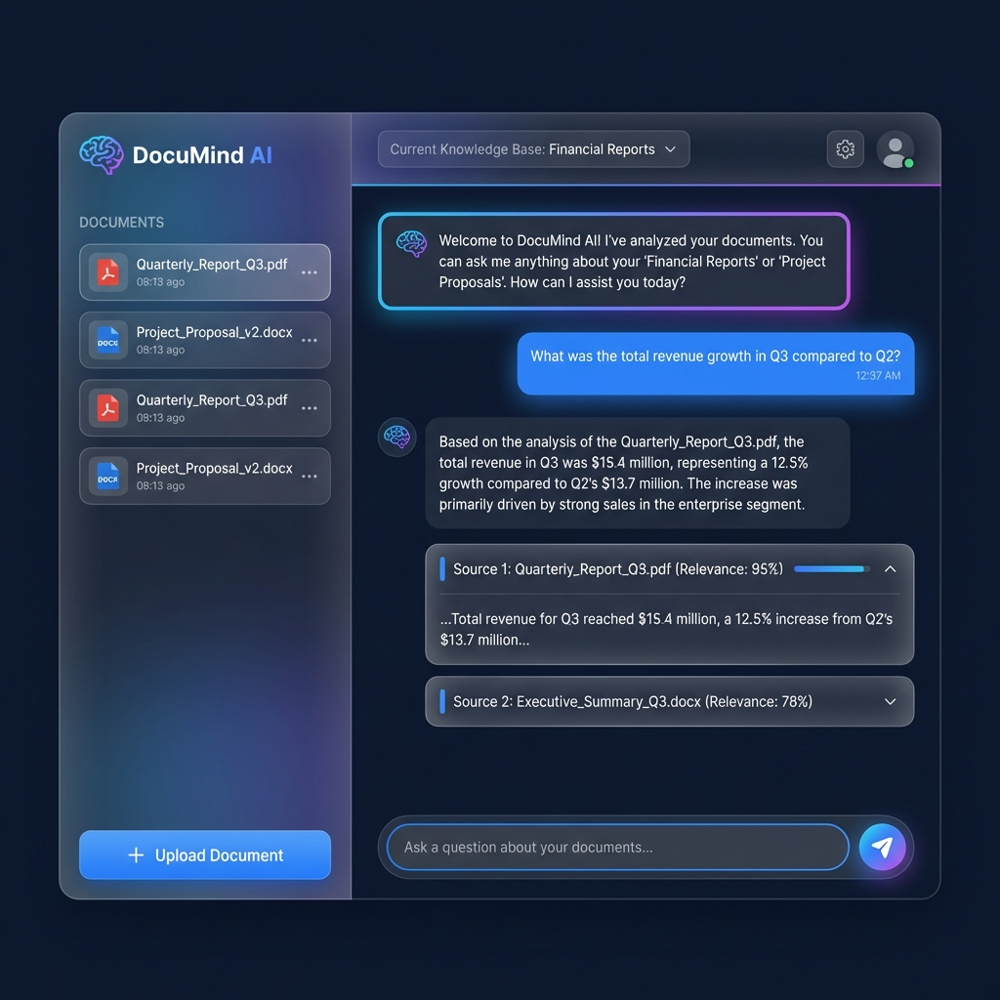
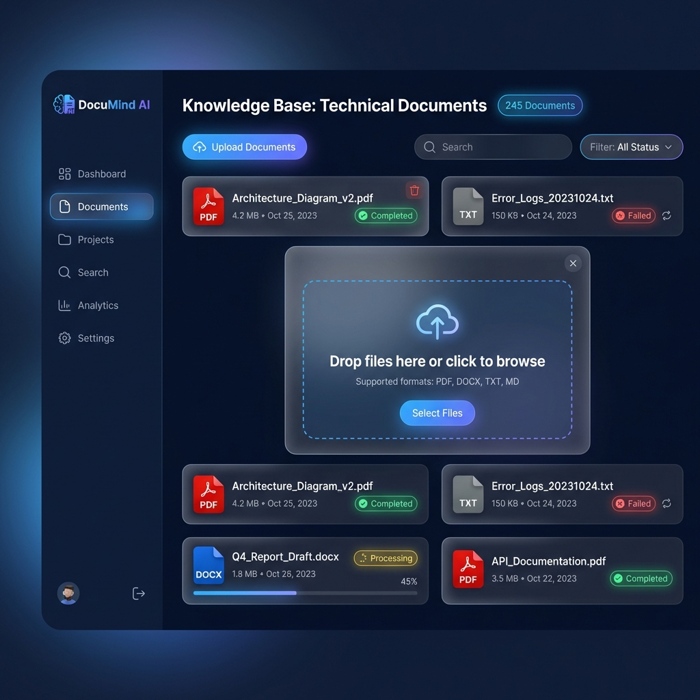
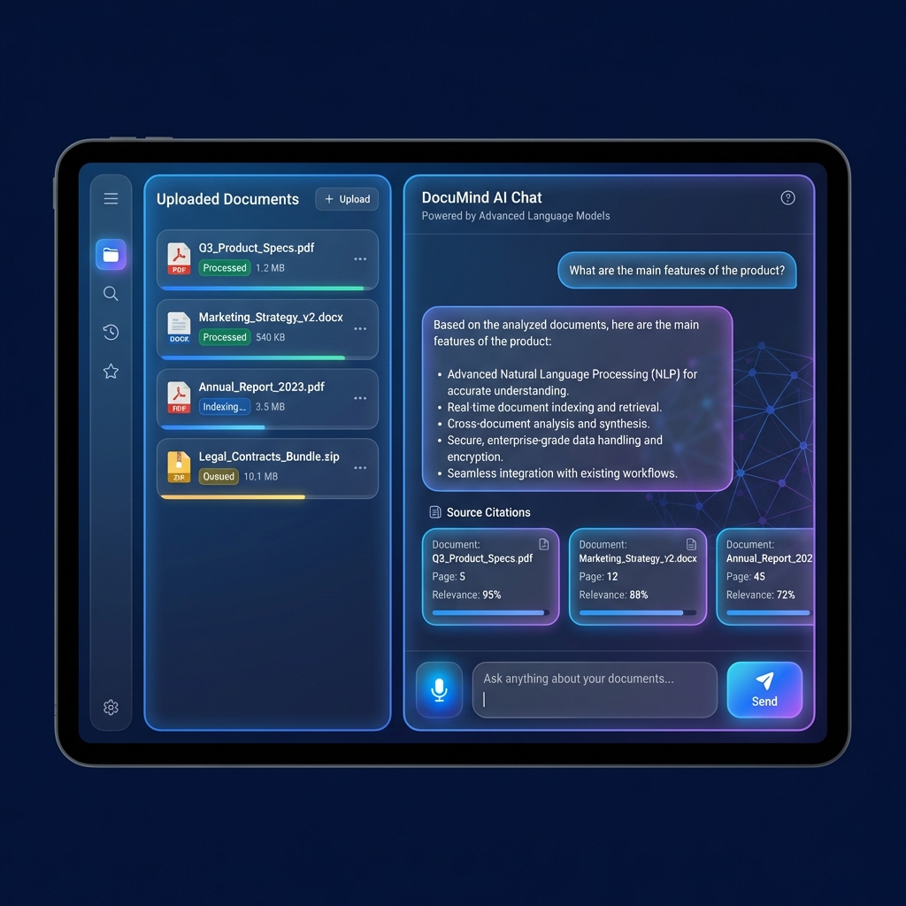

# DocuMind AI - UI 设计规范

> 版本: v1.0  
> 更新日期: 2026-01-26

---

## 1. 设计概览

### 1.1 设计理念

DocuMind AI 采用现代深色主题设计，强调：

- **专业感**：企业级产品的视觉质感
- **易用性**：清晰的信息层级和交互反馈
- **沉浸感**：深色背景减少视觉疲劳
- **科技感**：渐变、玻璃拟态等现代设计元素

### 1.2 设计稿预览

#### 主聊天界面



**设计说明**：

- 左侧边栏展示已上传的文档列表
- 主区域为对话界面，支持多轮问答
- AI 回复包含来源引用卡片，可展开查看原文
- 底部输入框支持发送问题

---

#### 文档管理界面



**设计说明**：

- 卡片式布局展示文档列表
- 每个卡片显示文件类型、大小、处理状态
- 上传弹窗支持拖拽上传
- 状态徽章区分处理中/完成/失败

---

#### 知识库管理界面


**设计说明**：

- 网格布局展示知识库卡片
- 每个知识库显示文档数量和分块数量
- 支持快速创建新知识库
- 悬停显示操作按钮

---

#### 平板响应式布局



**设计说明**：

- 针对平板设备优化的双栏布局
- 左侧文档列表，右侧对话区域
- 触控友好的按钮尺寸
- 来源引用横向滚动展示

---

## 2. 设计规范

### 2.1 色彩系统

#### 主色调

| 名称     | 色值      | 用途         |
| -------- | --------- | ------------ |
| 背景色   | `#0f172a` | 主背景       |
| 卡片背景 | `#1e293b` | 卡片、气泡   |
| 边框色   | `#334155` | 分割线、边框 |

#### 强调色

| 名称   | 色值      | 用途             |
| ------ | --------- | ---------------- |
| 主蓝色 | `#3b82f6` | 按钮、链接、高亮 |
| 浅蓝色 | `#60a5fa` | 悬停状态         |
| 紫色   | `#8b5cf6` | 渐变辅助色       |

#### 状态色

| 名称   | 色值      | 用途       |
| ------ | --------- | ---------- |
| 成功绿 | `#22c55e` | 完成状态   |
| 警告黄 | `#eab308` | 处理中状态 |
| 错误红 | `#ef4444` | 失败状态   |

#### 文字色

| 名称   | 色值      | 用途       |
| ------ | --------- | ---------- |
| 主文字 | `#f8fafc` | 标题、正文 |
| 次文字 | `#94a3b8` | 辅助信息   |
| 弱文字 | `#64748b` | 占位符     |

### 2.2 字体规范

```css
/* 字体族 */
font-family:
  "Inter",
  -apple-system,
  BlinkMacSystemFont,
  "Segoe UI",
  sans-serif;

/* 字体大小 */
--text-xs: 12px;
--text-sm: 14px;
--text-base: 16px;
--text-lg: 18px;
--text-xl: 20px;
--text-2xl: 24px;
--text-3xl: 30px;

/* 字重 */
--font-normal: 400;
--font-medium: 500;
--font-semibold: 600;
--font-bold: 700;
```

### 2.3 间距规范

```css
/* 间距单位: 4px 基准 */
--space-1: 4px;
--space-2: 8px;
--space-3: 12px;
--space-4: 16px;
--space-5: 20px;
--space-6: 24px;
--space-8: 32px;
--space-10: 40px;
--space-12: 48px;
```

### 2.4 圆角规范

```css
--radius-sm: 4px;
--radius-md: 8px;
--radius-lg: 12px;
--radius-xl: 16px;
--radius-2xl: 24px;
--radius-full: 9999px;
```

### 2.5 阴影规范

```css
/* 卡片阴影 */
--shadow-card:
  0 4px 6px -1px rgba(0, 0, 0, 0.3), 0 2px 4px -2px rgba(0, 0, 0, 0.3);

/* 弹窗阴影 */
--shadow-modal: 0 25px 50px -12px rgba(0, 0, 0, 0.5);

/* 发光效果 */
--glow-blue: 0 0 20px rgba(59, 130, 246, 0.3);
```

---

## 3. 组件规范

### 3.1 按钮

```css
/* 主按钮 */
.btn-primary {
  background: linear-gradient(135deg, #3b82f6, #8b5cf6);
  color: #ffffff;
  padding: 10px 20px;
  border-radius: 8px;
  font-weight: 500;
}

/* 次要按钮 */
.btn-secondary {
  background: transparent;
  border: 1px solid #334155;
  color: #f8fafc;
  padding: 10px 20px;
  border-radius: 8px;
}

/* 危险按钮 */
.btn-danger {
  background: #ef4444;
  color: #ffffff;
}
```

### 3.2 卡片

```css
.card {
  background: rgba(30, 41, 59, 0.8);
  backdrop-filter: blur(10px);
  border: 1px solid rgba(51, 65, 85, 0.5);
  border-radius: 16px;
  padding: 20px;
}

.card:hover {
  border-color: #3b82f6;
  box-shadow: 0 0 20px rgba(59, 130, 246, 0.2);
}
```

### 3.3 输入框

```css
.input {
  background: #1e293b;
  border: 1px solid #334155;
  border-radius: 12px;
  padding: 12px 16px;
  color: #f8fafc;
}

.input:focus {
  border-color: #3b82f6;
  outline: none;
  box-shadow: 0 0 0 3px rgba(59, 130, 246, 0.2);
}

.input::placeholder {
  color: #64748b;
}
```

### 3.4 聊天气泡

```css
/* 用户消息 */
.message-user {
  background: #3b82f6;
  color: #ffffff;
  border-radius: 16px 16px 4px 16px;
  margin-left: auto;
  max-width: 70%;
}

/* AI 消息 */
.message-ai {
  background: #1e293b;
  color: #f8fafc;
  border-radius: 16px 16px 16px 4px;
  max-width: 85%;
}
```

### 3.5 状态徽章

```css
.badge {
  padding: 4px 8px;
  border-radius: 9999px;
  font-size: 12px;
  font-weight: 500;
}

.badge-success {
  background: rgba(34, 197, 94, 0.2);
  color: #22c55e;
}

.badge-warning {
  background: rgba(234, 179, 8, 0.2);
  color: #eab308;
}

.badge-error {
  background: rgba(239, 68, 68, 0.2);
  color: #ef4444;
}
```

---

## 4. 布局规范

### 4.1 页面结构

```
┌─────────────────────────────────────────────────────────────┐
│  Header (56px)                                              │
├──────────────┬──────────────────────────────────────────────┤
│              │                                              │
│   Sidebar    │              Main Content                    │
│   (280px)    │              (flex: 1)                       │
│              │                                              │
│              │                                              │
└──────────────┴──────────────────────────────────────────────┘
```

### 4.2 响应式断点

```css
/* 移动端 */
@media (max-width: 639px) {
}

/* 平板 */
@media (min-width: 640px) and (max-width: 1023px) {
}

/* 桌面 */
@media (min-width: 1024px) {
}

/* 大屏 */
@media (min-width: 1280px) {
}
```

---

## 5. 动效规范

### 5.1 过渡动画

```css
/* 默认过渡 */
transition: all 0.2s ease;

/* 悬停过渡 */
transition: all 0.15s ease-out;

/* 展开动画 */
transition: height 0.3s ease-in-out;
```

### 5.2 加载动画

```css
/* 脉冲动画 */
@keyframes pulse {
  0%,
  100% {
    opacity: 1;
  }
  50% {
    opacity: 0.5;
  }
}

/* 打字机效果 */
@keyframes typing {
  from {
    width: 0;
  }
  to {
    width: 100%;
  }
}
```

---

## 6. 图标规范

推荐使用 **Lucide Icons** 图标库：

```bash
npm install lucide-react
```

常用图标：

| 图标            | 用途   |
| --------------- | ------ |
| `FileText`      | 文档   |
| `Upload`        | 上传   |
| `Send`          | 发送   |
| `MessageSquare` | 对话   |
| `Database`      | 知识库 |
| `Settings`      | 设置   |
| `Trash2`        | 删除   |
| `Check`         | 完成   |
| `Loader`        | 加载中 |

---

## 7. React + shadcn/ui 实现指南

### 7.1 技术栈

| 技术         | 版本   | 用途     |
| ------------ | ------ | -------- |
| React        | 18.x   | UI 框架  |
| TypeScript   | 5.x    | 类型安全 |
| Vite         | 5.x    | 构建工具 |
| Tailwind CSS | 3.x    | 样式框架 |
| shadcn/ui    | latest | 组件库   |
| React Router | 6.x    | 路由管理 |

### 7.2 项目初始化

```bash
# 创建 Vite 项目
npx create-vite@latest frontend --template react-ts

# 安装 Tailwind CSS
npm install -D tailwindcss postcss autoprefixer
npx tailwindcss init -p

# 初始化 shadcn/ui
npx shadcn-ui@latest init

# 安装常用组件
npx shadcn-ui@latest add button card input dialog avatar badge
npx shadcn-ui@latest add scroll-area accordion dropdown-menu
```

### 7.3 Tailwind 配置

```js
// tailwind.config.js
module.exports = {
  darkMode: ["class"],
  content: ["./src/**/*.{ts,tsx}"],
  theme: {
    extend: {
      colors: {
        background: "#0f172a",
        card: "#1e293b",
        border: "#334155",
        primary: "#3b82f6",
        accent: "#8b5cf6",
      },
    },
  },
};
```

### 7.4 全局样式

```css
/* src/index.css */
@tailwind base;
@tailwind components;
@tailwind utilities;

@layer base {
  :root {
    --background: 222.2 84% 4.9%;
    --foreground: 210 40% 98%;
    --card: 222.2 47% 11%;
    --card-foreground: 210 40% 98%;
    --primary: 217.2 91.2% 59.8%;
    --primary-foreground: 222.2 47.4% 11.2%;
  }

  body {
    @apply bg-background text-foreground;
    font-family: "Inter", sans-serif;
  }
}
```

### 7.5 组件示例

#### ChatMessage 组件

```tsx
// src/components/ChatMessage.tsx
import { cn } from "@/lib/utils";
import { Avatar, AvatarFallback } from "@/components/ui/avatar";

interface ChatMessageProps {
  role: "user" | "assistant";
  content: string;
}

export function ChatMessage({ role, content }: ChatMessageProps) {
  return (
    <div
      className={cn(
        "flex gap-3 p-4",
        role === "user" ? "flex-row-reverse" : "",
      )}
    >
      <Avatar>
        <AvatarFallback>{role === "user" ? "U" : "AI"}</AvatarFallback>
      </Avatar>
      <div
        className={cn(
          "rounded-2xl px-4 py-2 max-w-[70%]",
          role === "user"
            ? "bg-primary text-primary-foreground rounded-tr-sm"
            : "bg-card text-card-foreground rounded-tl-sm",
        )}
      >
        {content}
      </div>
    </div>
  );
}
```

#### FileUploader 组件

```tsx
// src/components/FileUploader.tsx
import { useCallback } from "react";
import { useDropzone } from "react-dropzone";
import { Upload } from "lucide-react";

interface FileUploaderProps {
  onUpload: (files: File[]) => void;
}

export function FileUploader({ onUpload }: FileUploaderProps) {
  const onDrop = useCallback(
    (acceptedFiles: File[]) => {
      onUpload(acceptedFiles);
    },
    [onUpload],
  );

  const { getRootProps, getInputProps, isDragActive } = useDropzone({
    onDrop,
    accept: {
      "application/pdf": [".pdf"],
      "application/vnd.openxmlformats-officedocument.wordprocessingml.document":
        [".docx"],
      "text/plain": [".txt"],
      "text/markdown": [".md"],
    },
  });

  return (
    <div
      {...getRootProps()}
      className={cn(
        "border-2 border-dashed rounded-xl p-8 text-center cursor-pointer transition-colors",
        isDragActive
          ? "border-primary bg-primary/10"
          : "border-border hover:border-primary/50",
      )}
    >
      <input {...getInputProps()} />
      <Upload className="mx-auto h-12 w-12 text-muted-foreground" />
      <p className="mt-2 text-sm text-muted-foreground">
        {isDragActive ? "释放文件以上传" : "拖拽文件到此处，或点击选择"}
      </p>
    </div>
  );
}
```

### 7.6 API 调用

```tsx
// src/lib/api.ts
const API_BASE = import.meta.env.VITE_API_URL || "http://localhost:8000/api/v1";

export async function fetchKnowledgeBases() {
  const response = await fetch(`${API_BASE}/kb`);
  return response.json();
}

export async function uploadDocument(kbId: string, file: File) {
  const formData = new FormData();
  formData.append("kb_id", kbId);
  formData.append("file", file);

  const response = await fetch(`${API_BASE}/documents/upload`, {
    method: "POST",
    body: formData,
  });
  return response.json();
}

// SSE 流式聊天
export function streamChat(
  kbId: string,
  message: string,
  onChunk: (text: string) => void,
) {
  const eventSource = new EventSource(
    `${API_BASE}/chat/stream?kb_id=${kbId}&message=${encodeURIComponent(message)}`,
  );

  eventSource.onmessage = (event) => {
    const data = JSON.parse(event.data);
    onChunk(data.content);
  };

  eventSource.onerror = () => {
    eventSource.close();
  };

  return eventSource;
}
```

---

## 附录：设计文件清单

| 文件名                             | 说明                 |
| ---------------------------------- | -------------------- |
| `chat_interface_design_*.png`      | 主聊天界面设计稿     |
| `document_management_design_*.png` | 文档管理界面设计稿   |
| `knowledge_base_page_*.png`        | 知识库管理界面设计稿 |
| `mobile_responsive_design_*.png`   | 平板响应式设计稿     |
