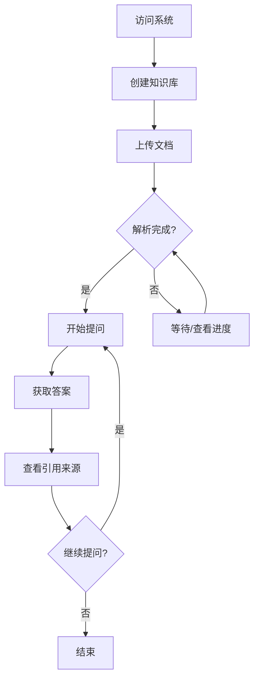
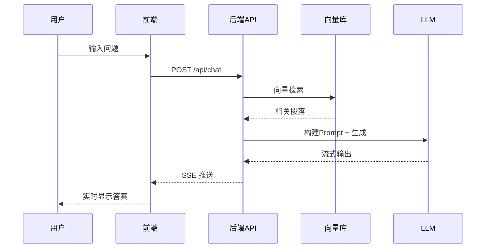

# DocuMind AI - 产品需求文档 (PRD)

> 版本: v1.0  
> 更新日期: 2026-01-26  
> 作者: Deep Learning Course Capstone Project

---

## 1. 项目背景

### 1.1 项目定位

DocuMind AI 是一款面向企业和个人用户的智能文档问答系统。通过结合检索增强生成（RAG）技术与大语言模型（LLM），使用户能够与自己的文档进行自然语言对话，快速获取所需信息。

### 1.2 目标用户

| 用户类型   | 典型场景                   | 核心诉求                   |
| ---------- | -------------------------- | -------------------------- |
| 知识工作者 | 查阅技术文档、研究报告     | 快速定位信息，减少阅读时间 |
| 企业员工   | 查询内部规章制度、产品手册 | 即时获取准确答案           |
| 研究人员   | 文献综述、论文检索         | 跨文档信息整合             |
| 学生       | 学习资料查询、作业辅助     | 理解复杂概念               |

### 1.3 产品愿景

> "让每一份文档都成为可对话的智能助手"

---

## 2. 功能需求

### 2.1 核心功能模块

```
┌─────────────────────────────────────────────────────────┐
│                    DocuMind AI 功能架构                   │
├─────────────────────────────────────────────────────────┤
│                                                          │
│  ┌──────────────┐  ┌──────────────┐  ┌──────────────┐   │
│  │  文档管理     │  │  智能问答     │  │  知识库管理   │   │
│  └──────┬───────┘  └──────┬───────┘  └──────┬───────┘   │
│         │                 │                 │           │
│  ┌──────▼───────┐  ┌──────▼───────┐  ┌──────▼───────┐   │
│  │ · 文档上传    │  │ · 单轮问答    │  │ · 知识库创建  │   │
│  │ · 格式转换    │  │ · 多轮对话    │  │ · 文档分组    │   │
│  │ · 解析入库    │  │ · 来源引用    │  │ · 权限管理    │   │
│  │ · 状态追踪    │  │ · 答案评价    │  │ · 统计分析    │   │
│  └──────────────┘  └──────────────┘  └──────────────┘   │
│                                                          │
└─────────────────────────────────────────────────────────┘
```

### 2.2 功能详细说明

#### 2.2.1 文档管理模块

| 功能项   | 描述                               | 优先级 |
| -------- | ---------------------------------- | ------ |
| 文档上传 | 支持拖拽/点击上传，单文件最大 50MB | P0     |
| 格式支持 | PDF, DOCX, TXT, MD                 | P0     |
| 批量上传 | 一次最多上传 10 个文件             | P1     |
| 上传进度 | 实时显示解析进度和状态             | P1     |
| 文档预览 | 上传后可预览文档内容               | P2     |
| 文档删除 | 删除文档及其向量索引               | P0     |

**文档处理流程**：

```
上传文件 → 格式检测 → 内容提取 → 文本分块 → 向量化 → 存入索引 → 完成
```

#### 2.2.2 智能问答模块

| 功能项       | 描述                       | 优先级 |
| ------------ | -------------------------- | ------ |
| 自然语言提问 | 用户以自然语言输入问题     | P0     |
| 语义检索     | 基于向量相似度检索相关段落 | P0     |
| 答案生成     | LLM 基于检索内容生成回答   | P0     |
| 来源引用     | 显示答案来源的文档和段落   | P0     |
| 多轮对话     | 支持上下文关联的连续对话   | P1     |
| 答案反馈     | 用户可标记答案质量         | P2     |

**问答处理流程**：

```
用户提问 → 问题向量化 → 相似度检索 → Top-K 段落 → 构建 Prompt → LLM 生成 → 返回答案
```

#### 2.2.3 知识库管理模块

| 功能项     | 描述                     | 优先级 |
| ---------- | ------------------------ | ------ |
| 创建知识库 | 自定义知识库名称和描述   | P0     |
| 知识库列表 | 展示所有知识库卡片       | P0     |
| 知识库切换 | 在不同知识库间切换问答   | P1     |
| 文档统计   | 显示文档数量、总大小等   | P1     |
| 知识库删除 | 删除知识库及所有关联数据 | P0     |

---

## 3. 非功能需求

### 3.1 性能需求

| 指标         | 要求                   |
| ------------ | ---------------------- |
| 文档解析速度 | < 5秒/MB               |
| 问答响应延迟 | 首字输出 < 2秒（流式） |
| 向量检索延迟 | < 500ms（10万条向量）  |
| 并发支持     | ≥ 10 用户同时使用      |

### 3.2 可用性需求

| 指标       | 要求               |
| ---------- | ------------------ |
| 系统可用性 | 99.5%（开发环境）  |
| 错误处理   | 所有异常有友好提示 |
| 响应式设计 | 支持 PC 和平板访问 |

### 3.3 安全需求

| 指标     | 要求                 |
| -------- | -------------------- |
| 数据存储 | 所有数据本地存储     |
| 文件校验 | 上传前校验文件类型   |
| 输入过滤 | 防止 Prompt 注入攻击 |

---

## 4. 用户界面设计

### 4.1 页面结构

```
┌─────────────────────────────────────────────────────────────┐
│  🧠 DocuMind AI                    [知识库选择 ▼]  [设置]   │
├─────────────────────────────────────────────────────────────┤
│                                                             │
│  ┌────────────────────┐  ┌────────────────────────────────┐ │
│  │                    │  │                                │ │
│  │    📁 文档列表     │  │        💬 对话区域             │ │
│  │                    │  │                                │ │
│  │  ─────────────────│  │  ┌────────────────────────────┐│ │
│  │  📄 技术文档.pdf   │  │  │ 🤖 欢迎使用 DocuMind AI！ ││ │
│  │  📄 产品手册.docx  │  │  │    请上传文档开始提问     ││ │
│  │  📄 学习笔记.md    │  │  └────────────────────────────┘│ │
│  │                    │  │                                │ │
│  │  ─────────────────│  │                                │ │
│  │                    │  │                                │ │
│  │  [+ 上传文档]      │  │                                │ │
│  │                    │  │                                │ │
│  └────────────────────┘  │  ┌────────────────────────────┐│ │
│                          │  │ 💬 请输入您的问题...   [发送]││ │
│                          │  └────────────────────────────┘│ │
│                          └────────────────────────────────┘ │
└─────────────────────────────────────────────────────────────┘
```

### 4.2 核心页面

| 页面         | 说明                             |
| ------------ | -------------------------------- |
| 首页/对话页  | 主交互界面，包含文档列表和对话区 |
| 知识库管理页 | 管理多个知识库                   |
| 文档详情页   | 查看文档内容和分块情况           |
| 设置页       | 模型配置、参数调整               |

### 4.3 交互流程

#### 4.3.1 新用户使用流程



#### 4.3.2 问答交互流程



---

## 5. 数据模型

### 5.1 核心实体

```
┌──────────────┐       ┌──────────────┐       ┌──────────────┐
│  KnowledgeBase│       │   Document   │       │    Chunk     │
├──────────────┤       ├──────────────┤       ├──────────────┤
│ id           │──1:N──│ id           │──1:N──│ id           │
│ name         │       │ kb_id        │       │ doc_id       │
│ description  │       │ filename     │       │ content      │
│ created_at   │       │ file_type    │       │ embedding    │
│ updated_at   │       │ file_size    │       │ chunk_index  │
└──────────────┘       │ status       │       │ metadata     │
                       │ created_at   │       └──────────────┘
                       └──────────────┘

┌──────────────┐       ┌──────────────┐
│ Conversation │       │   Message    │
├──────────────┤       ├──────────────┤
│ id           │──1:N──│ id           │
│ kb_id        │       │ conv_id      │
│ title        │       │ role         │
│ created_at   │       │ content      │
└──────────────┘       │ sources      │
                       │ created_at   │
                       └──────────────┘
```

### 5.2 数据存储

| 数据类型 | 存储方式            |
| -------- | ------------------- |
| 元数据   | SQLite / PostgreSQL |
| 向量索引 | FAISS / Milvus      |
| 原始文件 | 本地文件系统        |
| 会话历史 | SQLite              |

---

## 6. 验收标准

### 6.1 功能验收

- [ ] 能够上传 PDF、DOCX、TXT、MD 文件
- [ ] 文档自动解析并构建向量索引
- [ ] 能够以自然语言提问并获得相关回答
- [ ] 回答包含来源引用（文档名 + 段落）
- [ ] 支持多轮对话
- [ ] 能够创建和管理多个知识库

### 6.2 性能验收

- [ ] 单文档（< 10MB）解析时间 < 30秒
- [ ] 问答首字输出 < 3秒
- [ ] 系统在 10 个并发用户下稳定运行

### 6.3 质量验收

- [ ] 问答准确率 > 80%（主观评估）
- [ ] 检索召回相关段落在 Top-5 中
- [ ] 无明显的幻觉问题

---

## 7. 项目范围

### 7.1 本期包含 (In Scope)

- ✅ 单机部署版本
- ✅ 主流文档格式支持
- ✅ 基础问答功能
- ✅ 知识库管理
- ✅ 对话历史
- ✅ 来源引用

### 7.2 本期不包含 (Out of Scope)

- ❌ 用户登录认证系统
- ❌ 多用户权限管理
- ❌ 云端部署
- ❌ 移动端适配
- ❌ 文档 OCR 识别
- ❌ 表格/图表理解

### 7.3 未来规划 (Future)

- 🔮 用户认证与权限管理
- 🔮 OCR 图片文档识别
- 🔮 表格数据问答
- 🔮 多模态内容理解
- 🔮 云端部署版本
- 🔮 API 开放平台

---

## 8. 风险评估

| 风险项             | 可能性 | 影响 | 缓解措施                   |
| ------------------ | ------ | ---- | -------------------------- |
| LLM 推理速度慢     | 高     | 中   | 使用量化模型、流式输出     |
| 向量检索准确率不高 | 中     | 高   | 优化分块策略、调整嵌入模型 |
| 文档解析格式异常   | 中     | 中   | 完善错误处理、支持降级     |
| 显存不足           | 中     | 高   | 提供 CPU 推理备选方案      |

---

## 附录

### A. 术语表

| 术语      | 说明                                         |
| --------- | -------------------------------------------- |
| RAG       | Retrieval-Augmented Generation，检索增强生成 |
| LLM       | Large Language Model，大语言模型             |
| Embedding | 嵌入向量，文本的数值表示                     |
| Chunk     | 文档分块，长文档切分的小段落                 |
| Vector DB | 向量数据库，存储和检索嵌入向量               |

### B. 参考资料

- [LangChain Documentation](https://docs.langchain.com)
- [FAISS Documentation](https://faiss.ai)
- [Sentence Transformers](https://sbert.net)
- [FastAPI Documentation](https://fastapi.tiangolo.com)
